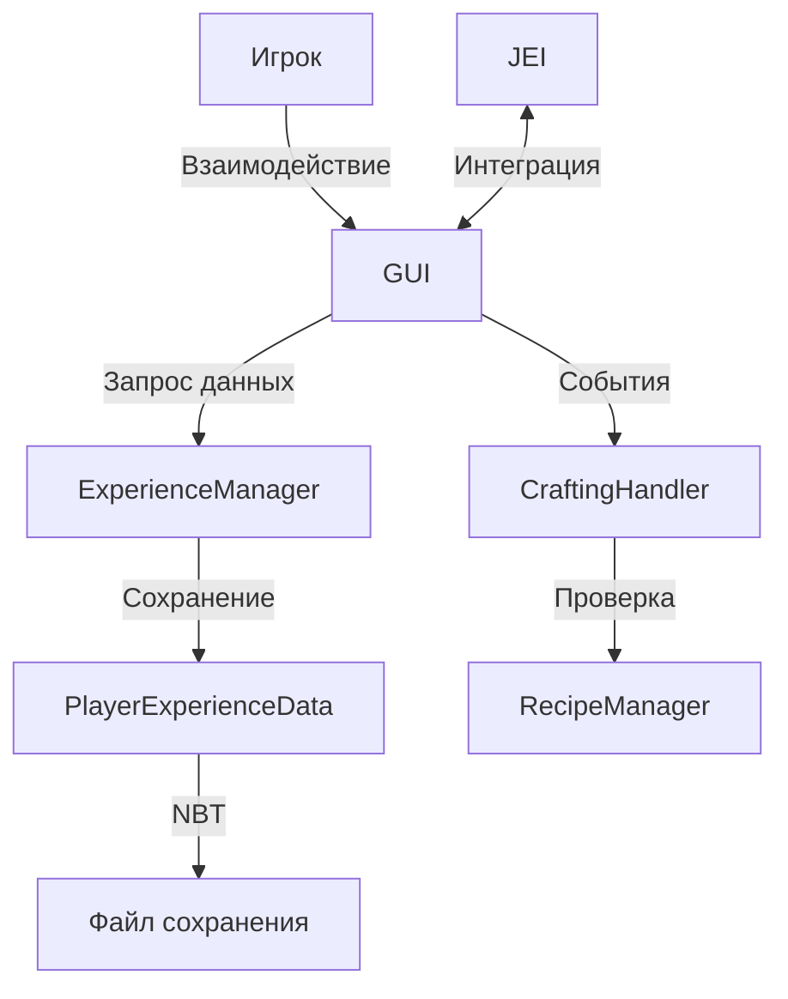

# CraftMastery - Статус проекта

## Техническое задание (ТЗ)

**Проект:** CraftMastery
**Версия:** Minecraft 1.12.2
**Автор:** Khim_Khaosow

### 🎯 Цель
Создать мод для гибкого управления крафтами, вкладками, тегами и системой опыта в Minecraft, с полной настройкой прав доступа, кастомными условиями разблокировки рецептов и визуальным интерфейсом.
Мод должен позволять администраторам полностью контролировать процесс изучения, открытия и блокировки крафтов, а также систему очков и опыта, предоставляя игрокам RPG-подобную систему прогрессии.

### ⚙️ Основной функционал

#### 🔒 Права доступа
Все действия в моде зависят от настроек прав.
**Типы действий, зависящие от прав:**
- Открытие интерфейса изучения
- Изучение рецептов
- Добавление, изменение и удаление вкладок
- Настройка рецептов и их параметров
- Выдача опыта и очков
- Сброс рецептов и вкладок

**Настройка прав:**
- Для отдельных игроков, групп (игроки, OP, администраторы)
- Через интерфейс мода или конфигурационные файлы
- Возможность создания пользовательских ролей с индивидуальным набором разрешений

#### 💫 Система опыта и уровней
Мод использует собственную систему опыта (независимую от ванильной).

**Источники получения опыта:**
- Добыча блоков
- Создание и использование предметов
- Убийство мобов и игроков
- Нахождение или крафт редких предметов (опционально)

**Опыт и уровни:**
- Опыт влияет на уровень игрока
- При повышении уровня игрок получает очки
- Все параметры настраиваются через интерфейс или конфиг сервера

#### 💎 Очки
**Типы очков:**
- **Очки изучения** — тратятся на открытие рецептов
- **Спец-очки** — используются для открытия определённых вкладок или рецептов
- **Очки сброса рецептов** — позволяют сбросить изученные рецепты
- **Очки сброса вкладок** — сбрасывают прогресс всей вкладки и возвращают потраченные очки

**Механика:**
- Очки выдаются при повышении уровня
- Настройка количества выдаваемых очков — в конфиге или интерфейсе
- При сбросе (игроком или администратором) очки возвращаются

#### 🗂 Вкладки
**Базовая вкладка:**
- Содержит ванильные рецепты Minecraft
- Может быть переименована
- Можно добавлять или убирать рецепты (при наличии прав)

**Создание новых вкладок:**
- Администратор может создавать, удалять и переименовывать вкладки
- Примеры: "Техника", "Магия", "Оружие"
- Для каждой вкладки можно задать тег

**Функционал вкладок:**
- Настройка блокировки других вкладок при изучении любого рецепта внутри текущей
- Настройка стоимости сброса вкладки
- Возможность указать, какие вкладки или рецепты разблокируются при изучении определённого рецепта
- При сбросе вкладки возвращаются все очки, потраченные на рецепты внутри неё

**Интерфейс настройки:**
- Окно, где можно выбрать вкладку или рецепт для разблокировки/блокировки
- Отображение связей (например, "изучив вкладку Полицейский → блокируется вкладка Грабитель")

#### 🧩 Рецепты
**Изначально все рецепты (включая ванильные и модовые) игрокам недоступны.**
- У предметов или крафтов есть тег/переменная "craftmastery:unlocked"
- Если тег отсутствует, игрок не может скрафтить или использовать предмет

**При попытке крафта без знания появляется сообщение:**
- "Я не знаю, как это делать."
- "Я не знаю, как это работает."
- "Я не знаю, что это такое."

**Настройки рецепта (через интерфейс):**
- Стоимость в очках
- Условия разблокировки (уровень, очки, другие рецепты)
- Какие рецепты/вкладки разблокирует при изучении
- Возможность добавить сообщение при изучении
- Позиция на графе рецептов (drag'n'drop система)

**Типы рецептов:**
- Обычные
- Технические
- Магические
- Маг-технические
- Возможность добавлять новые типы администратором

#### 🏷 Теги и фильтры
- Каждому рецепту можно назначить тег
- Теги можно добавлять и редактировать через интерфейс
- Пример: все рецепты вкладки "Техника" автоматически получают тег технический
- Эти теги используются для фильтрации, JEI-интеграции или логики разблокировки

#### 🧠 Интерфейс
**Полноценный визуальный интерфейс с вкладками и графом рецептов.**

**Отображение:**
- Уровня игрока
- Количества опыта
- Количества очков

**Панель администратора (если есть права):**
- Управление вкладками, рецептами, правами, настройками выдачи опыта/очков
- Возможность динамического редактирования без перезапуска сервера
- Поддержка команд для альтернативного управления

#### 📘 Книги изучения
- Книги позволяют изучать рецепты без траты очков
- Привязываются к определённым вкладкам или тегам рецептов
- Показывают только доступные игроку рецепты

#### 🔄 Интеграция и совместимость
**JEI:**
- Отображение только разблокированных рецептов
- Опционально (можно отключить)

**Совместимость с другими модами:**
- Поддержка автоматического добавления рецептов из других модов в базу CraftMastery
- Система тегов и разблокировок работает через общий API

#### 💾 Система хранения
- Все данные хранятся в формате JSON или внутренней БД
- Возможность ручного редактирования и экспорта/импорта данных

#### ⚡ Команды
```
/cm giveexp <player> <amount> — выдать опыт
/cm givepoints <player> <amount> — выдать очки
/cm reset <player> [tab/all] — сбросить рецепты или вкладки
/cm addtab <name> — создать вкладку
/cm settier <tab> <level> — задать уровень доступа
/cm reload — перезагрузить конфиг без рестарта сервера
```

#### 🔁 Синхронизация
- Все данные синхронизируются между сервером и клиентом в реальном времени
- Изменения, внесённые администратором, применяются мгновенно без перезапуска

### 📘 Дополнение к ТЗ: Визуальный интерфейс CraftMastery

#### 1. Общая концепция
Интерфейс выполнен в стиле "магической книги знаний".
Основная часть — разворот книги, где рецепты отображаются как узлы-страницы, соединённые линиями (граф связей).
Все элементы управления расположены вокруг книги, но стилизованы под часть её оформления.

#### 2. Верхняя панель вкладок
- **Расположение:** верхняя часть экрана, над страницами
- **Назначение:** переключение между вкладками (категориями крафтов)
- **Особенности:**
  - Горизонтальный ряд кнопок со скроллингом
  - Активная вкладка подсвечена зелёным индикатором снизу
  - Стрелки `< >` по бокам для прокрутки вкладок
  - Названия вкладок: "Основа", "Просто для теста" и т.д.
  - При наведении — лёгкое подсвечивание
- **Возможности:**
  - Создание новых вкладок (админ)
  - Переименование
  - Настройка блокировок и стоимости открытия

#### 3. Левый верхний блок (навигация и настройки)
- **Расположение:** левый верхний угол
- **Содержит:**
  - ⚙️ Красная шестерёнка — админ-настройки (права, вкладки, рецепты)
  - ⚙️ Серая шестерёнка — пользовательские настройки (интерфейс, язык, подсказки)
  - ⬅️ Кнопка "Назад" — выход из книги
- **Особенности:**
  - При наведении — мягкая пульсация/подсветка
  - Открывает модальные окна настроек
  - Подсказки при наведении

#### 4. Левая вертикальная панель (очки и уровень)
- **Расположение:** слева, рядом с книгой
- **Содержимое:**
  ```
  текущие очки
  спец очки — 0
  очки изучения — 4
  очки сброса — 2
  ```
- **Функционал:**
  - Подсветка типов очков (иконки)
  - При наведении — описание или история начислений
  - При клике (если админ) — окно редактирования очков
  - Недостаток очков подсвечивается красным

#### 5. Правая верхняя кнопка «+»
- **Расположение:** верхний правый угол страницы книги
- **Функция:** добавление нового рецепта
- **При нажатии открывается окно:**
  - Название рецепта
  - Иконка / текстура
  - Тип крафта
  - Стоимость изучения / сброса
  - Координаты на графе
  - Связанные рецепты / вкладки
  - Сообщение при изучении

#### 6. Граф рецептов (внутри книги)
- **Каждый рецепт — узел (квадрат с иконкой и подписью)**
- **Изученные узлы — зелёные**
- **Неизученные — серые**
- **Связи между узлами — чёрные линии**
- **При наведении показывается:**
  - Название рецепта
  - Стоимость изучения
  - Условия разблокировки
- **При клике:**
  - Если изучен — окно информации
  - Если не изучен — окно подтверждения ("изучить за 1 очко")
- **Возможности администратора:**
  - Перемещение узлов (drag & drop)
  - Изменение связей
  - Добавление / удаление узлов

#### 7. Нижняя панель прогресса
- **Расположение:** вдоль нижней границы экрана
- **Вид:** Чёрная полоса, внутри зелёная линия прогресса
- **Слева:** 1 уровень
- **Справа:** 4/10 — текущий прогресс опыта
- **Анимации:** Плавное заполнение при получении опыта, эффект вспышки при повышении уровня

#### 8. Модальные окна и взаимодействия
**Окна настройки:**
- Права доступа
- Управление вкладками
- Редактирование рецепта
- Добавление рецепта
- История/лог очков

**Popup при изучении:**
- Текст: "Изучить рецепт X за 1 очко изучения?"
- Кнопки: [Изучить] [Отмена]
- Если при изучении разблокируются другие вкладки — отображается список

**Toasts (уведомления):**
- Верхний правый угол:
  - ✅ "Рецепт изучен!"
  - ❌ "Недостаточно очков!"
  - ⚙️ "Настройки сохранены"

#### 9. Состояния и визуальные эффекты
- **Недоступные элементы:** полупрозрачные, с серым текстом
- **Новые элементы:** мигающая рамка
- **Hover:** лёгкое свечение
- **Активное состояние:** зелёная подсветка

#### 💠 Текстовый макет интерфейса (ASCII-схема)
```
┌───────────────────────────────────────────────────────────────────────────────┐
│  ←   ⚙(красная) ⚙(серая)                [ ОСНОВА ] [ ТЕСТ ] [ ... ]   →      │
│───────────────────────────────────────────────────────────────────────────────│
│ ┌───────────────┐ ┌─────────────────────────────────────────────────────────┐ │
│ │текущие очки   │ │                      📖 КНИГА КРАФТОВ                   │ │
│ │---------------│ │ ┌─────────────────────────────────────────────────────┐ │ │
│ │ спец очки: 0  │ │ │ [🟩] рецепт 1 (1 очко сброса)                       │ │ │
│ │ изучение: 4   │ │ │   │                                                 │ │ │
│ │ сброс: 2      │ │ │  [⬜] рецепт 2 (1 очко изучения)                    │ │ │
│ │---------------│ │ │    │                                                │ │ │
│ │ уровень: 1    │ │ │   [⬜] рецепт 3 (1 очко изучения)                   │ │ │
│ └───────────────┘ │ │                                                     │ │ │
│                   │ └─────────────────────────────────────────────────────┘ │ │
│                   │        + (добавить рецепт)                              │ │
│                   └─────────────────────────────────────────────────────────┘ │
│───────────────────────────────────────────────────────────────────────────────│
│ [1 уровень] ████████░░░░░░░░░░░░░░░░░░░░░░░░ 4/10                           │
└───────────────────────────────────────────────────────────────────────────────┘
```

**🟩 — изученный рецепт**
**⬜ — не изученный рецепт**

#### 🔧 Интеграции и состояния
- **JEI:** отображение только изученных рецептов
- **CraftTweaker:** экспорт и импорт рецептов из JSON
- **Серверная синхронизация:** мгновенное обновление всех элементов

---

## Текущее состояние (Что уже реализовано)

### ✅ Завершенные компоненты:

1. **Система прав доступа (PermissionManager)**
   - Базовая структура прав (PermissionType)
   - Проверка прав для различных действий
   - Интеграция с GUI

2. **Система опыта (ExperienceManager)**
   - PlayerExperienceData для хранения данных игрока
   - PointsType для различных типов очков
   - ExperienceType для источников опыта
   - Базовая логика начисления опыта

3. **Система рецептов (RecipeManager)**
   - RecipeEntry для описания рецептов
   - RecipeTag для тегов рецептов
   - Базовая система поиска и фильтрации
   - Загрузка рецептов из конфигурации

4. **Система вкладок (TabManager)**
   - Tab для описания вкладок
   - Логика изучения и блокировки вкладок
   - Интеграция с правами доступа

5. **Обработчик крафта (CraftingHandler)**
   - Блокировка неизученных рецептов
   - Возврат ресурсов при неудачном крафте
   - Начисление опыта за крафт
   - Предупреждения игроку

6. **GUI интерфейс (GuiCraftMastery)** - ПОЛНОСТЬЮ ПЕРЕДЕЛАН
   - Адаптивный интерфейс под разные размеры экрана
   - **Верхняя панель вкладок** с горизонтальным меню и стрелками прокрутки
   - **Админ-кнопки** в левом верхнем углу (шестеренки + стрелка назад)
   - **Левая панель очков** с полупрозрачным темным фоном и иконками
   - **Древо рецептов** с настоящими узлами и линиями соединений
   - **Нижняя панель прогресса** уровня (черная полоса с зеленым заполнением)
   - **Кнопка добавления рецепта** справа сверху (+)
   - **Интерактивная обработка кликов** для всех элементов

7. **Система команд (CommandRegistry)**
   - Базовые команды для управления модом
   - Интеграция с правами доступа

8. **Древо рецептов (RecipeTreeWidget)**
   - Визуальное отображение рецептов в виде узлов
   - Различные состояния узлов (изучен/доступен/заблокирован)
   - Интерактивное взаимодействие с узлами

9. **Экран настроек (GuiPlayerSettings & GuiAdminSettingsScreen)**
   - Пользовательские настройки HUD и уведомлений с сохранением в конфиг
   - Админ-настройки множителей опыта, конверсии очков и прав доступа
   - Выдача опыта/очков и синхронизация с ExperienceManager и PermissionManager

### 🔧 Частично реализованные компоненты:

1. **Конфигурация (ModConfig)**
   - Базовые настройки мода
   - Настройки опыта и очков
   - Нужно расширить для полного функционала

2. **Интеграция с JEI**
   - Базовая структура для скрытия рецептов
   - Нужно доработать полную интеграцию

3. **Сохранение данных**
   - Базовая структура для JSON
   - Нужно реализовать полную систему сохранения

## Текущее состояние (Что уже реализовано)

### ✅ Завершенные компоненты:

1. **Система прав доступа (PermissionManager)**
   - Базовая структура прав (PermissionType)
   - Проверка прав для различных действий
   - Интеграция с GUI

2. **Система опыта (ExperienceManager)**
   - PlayerExperienceData для хранения данных игрока
   - PointsType для различных типов очков
   - ExperienceType для источников опыта
   - Базовая логика начисления опыта

3. **Система рецептов (RecipeManager)**
   - RecipeEntry для описания рецептов
   - RecipeTag для тегов рецептов
   - Базовая система поиска и фильтрации
   - Загрузка рецептов из конфигурации

4. **Система вкладок (TabManager)**
   - Tab для описания вкладок
   - Логика изучения и блокировки вкладок
   - Интеграция с правами доступа

5. **Обработчик крафта (CraftingHandler)**
   - Блокировка неизученных рецептов
   - Возврат ресурсов при неудачном крафте
   - Начисление опыта за крафт
   - Предупреждения игроку

6. **GUI интерфейс (GuiCraftMastery)** - ПОЛНОСТЬЮ ПЕРЕДЕЛАН
   - ✅ **ИСПРАВЛЕНА NullPointerException** при рендеринге
   - ✅ **Адаптивный интерфейс** под разные размеры экрана
   - ✅ **Верхняя панель вкладок** с горизонтальным меню и стрелками прокрутки
   - ✅ **Админ-кнопки** в левом верхнем углу (шестеренки + стрелка назад)
   - ✅ **Левая панель очков** с полупрозрачным темным фоном и иконками
   - ✅ **Древо рецептов** с настоящими узлами и линиями соединений
   - ✅ **Нижняя панель прогресса** уровня (черная полоса с зеленым заполнением)
   - ✅ **Кнопка добавления рецепта** справа сверху (+)
   - ✅ **Интерактивная обработка кликов** для всех элементов
   - ✅ **Система управления кнопками** без наложения вкладок

7. **Система команд (CommandRegistry)**
   - Базовые команды для управления модом
   - Интеграция с правами доступа

8. **Древо рецептов (RecipeTreeWidget)**
   - Визуальное отображение рецептов в виде узлов
   - Различные состояния узлов (изучен/доступен/заблокирован)
   - Интерактивное взаимодействие с узлами

### 🔧 Частично реализованные компоненты:

1. **Конфигурация (ModConfig)**
   - Базовые настройки мода
   - Настройки опыта и очков
   - Нужно расширить для полного функционала

2. **Интеграция с JEI**
   - Базовая структура для скрытия рецептов
   - Нужно доработать полную интеграцию

3. **Сохранение данных**
   - Базовая структура для JSON
   - Нужно реализовать полную систему сохранения

## План работ (Что нужно сделать)

### 🚨 Высокий приоритет:

1. **Полная система прав доступа**
   - [ ] Расширить PermissionType для всех необходимых прав
   - [ ] Система групп игроков (игроки, OP, администраторы)
   - [ ] Настройка прав через конфигурацию
   - [ ] Интерфейс управления правами

2. **Расширенная система опыта и очков**
   - [ ] Полная реализация всех типов очков (изучение, спец-очки, сброс)
   - [ ] Система получения опыта из различных источников
   - [ ] Настройка коэффициентов через конфигурацию
   - [ ] Система сброса и возврата очков

3. **Улучшенная система вкладок**
   - [ ] Полная настройка стоимости и блокировок
   - [ ] Условные связи между вкладками
   - [ ] Интерфейс редактирования вкладок
   - [ ] Сброс отдельных вкладок

4. **Расширенная система рецептов**
   - [ ] Полная настройка условий открытия
   - [ ] Система блокировок и разблокировок
   - [ ] Позиционирование на графе
   - [ ] Текстовые сообщения

5. **Улучшенный GUI**
   - [ ] Полноценное древо рецептов с линиями зависимостей
   - [ ] Панель очков и прогресса
   - [ ] Админ-кнопки и настройки
   - [ ] Окно выбора рецептов/вкладок

### 🔄 Средний приоритет:

6. **Книги изучения**
   - [ ] Создание книг для различных вкладок/тегов
   - [ ] Логика использования книг
   - [ ] Интеграция с инвентарем

7. **Система тегов рецептов**
   - [ ] Полная реализация всех типов тегов
   - [ ] Пользовательские теги
   - [ ] Фильтрация и отображение по тегам

8. **Интеграция с JEI**
   - [ ] Полное скрытие недоступных рецептов
   - [ ] Отображение только доступных рецептов
   - [ ] Настройки интеграции

### 📋 Низкий приоритет:

9. **Система сохранения данных**
   - [ ] Полная реализация JSON-хранения
   - [ ] Автоматическое сохранение/загрузка
   - [ ] Миграция данных между версиями

10. **Расширенные команды**
    - [ ] Команды выдачи очков и опыта
    - [ ] Команды сброса рецептов/вкладок
    - [ ] Команды управления правами

11. **Сетевая синхронизация**
    - [ ] Синхронизация данных между сервером и клиентами
    - [ ] Обработка изменений без перезапуска

12. **Тестирование и отладка**
    - [ ] Тестирование всех систем
    - [ ] Оптимизация производительности
    - [ ] Обработка ошибок и исключений

## Архитектура проекта

### Основные классы:
- `CraftMastery` - главный класс мода
- `PermissionManager` - управление правами
- `ExperienceManager` - система опыта
- `RecipeManager` - управление рецептами
- `TabManager` - управление вкладками
- `CraftingHandler` - обработчик крафта
- `GuiCraftMastery` - основной интерфейс (ПОЛНОСТЬЮ ПЕРЕДЕЛАН)
- `RecipeTreeWidget` - древо рецептов

### Конфигурационные файлы:
- `ModConfig` - настройки мода
- JSON-файлы для рецептов, вкладок, прав

### Структура ресурсов:
- `assets/craftmastery/` - текстуры, модели, звуки
- `config/craftmastery/` - конфигурационные файлы

## Требования к окружению:
- Minecraft 1.12.2
- Forge 14.23.5.2860+
- Java 8+

## Сроки разработки:
- Базовый функционал: 2-3 недели
- Полный функционал: 1-2 месяца
- Тестирование: 1 неделя

## Замечания:
- Проект использует современные практики Java
- Интерфейс адаптивен под разные размеры экрана
- Система максимально модульная и расширяемая
- Уделено внимание производительности и безопасности

## Последние изменения:
- ✅ **Добавлены экраны настроек**: `GuiPlayerSettings` и `GuiAdminSettingsScreen` с проверкой прав, сохранением в конфиг и обратной синхронизацией менеджеров
- ✅ **Расширен ModConfig**: методы `applyGuiSettings`, `applyExperienceSettings`, `applyPermissionSettings` для записи изменений из GUI
- ✅ **PermissionManager** теперь подтягивает значения по умолчанию из `ModConfig` и позволяет обновлять их во время работы
- ✅ **ExperienceManager** синхронизирует множители и коэффициенты конверсии с конфигом без перезагрузки
- ✅ **ИСПРАВЛЕНА критическая NullPointerException** в GUI при рендеринге
- ✅ **ИСПРАВЛЕНА проблема наложения вкладок** - теперь кнопки корректно очищаются при переключении
- ✅ **Улучшена система управления кнопками** - полная очистка и пересоздание при смене страниц
- ✅ **GUI полностью переделан** согласно детальному техническому описанию
- ✅ **Добавлена верхняя панель вкладок** с прокруткой и адаптивностью
- ✅ **Реализованы админ-кнопки** (шестеренки) и навигация
- ✅ **Создана левая панель очков** с иконками и полупрозрачным дизайном
- ✅ **Добавлена нижняя панель прогресса** уровня с зеленым заполнением
- ✅ **Реализовано настоящее древо рецептов** с узлами и линиями соединений
- ✅ **Обновлена обработка кликов** для всех элементов интерфейса
- ✅ **Создана система скрытия кнопок рецептов** в интерфейсе крафта (RecipeButtonHider)
- ✅ **Добавлен обработчик GUI крафта** (CraftingGuiHandler) для перехвата открытия интерфейса
- ✅ **Улучшен CraftingHandler** для блокировки Shift-кликов и множественных крафтов
- ✅ **Обновлена JEI интеграция** для скрытия неизученных рецептов
- ✅ **Создан кастомизируемый HUD** (CraftMasteryHUD.java) с прогрессом опыта и уровня
## 🏗️ Детальная структура кода

### 📦 Основные пакеты и классы


src/main/java/com/khimkhaosow/craftmastery/
├── client/                     # Клиентская часть мода
│   └── gui/                   # Графический интерфейс пользователя
│       └── ExperienceOverlay.java  # Оверлей опыта
│
├── commands/                  # Система команд
│   ├── CommandCraftMastery.java   # Основная команда мода
│   ├── CommandExperience.java     # Управление опытом
│   ├── CommandRecipes.java        # Управление рецептами
│   └── CommandRegistry.java       # Централизованная регистрация команд
│
├── config/                    # Конфигурация
│   ├── ModConfig.java         # Основные настройки
│   └── RecipeConfig.java      # Настройки рецептов
│
├── crafting/                  # Логика крафтинга
│   ├── CraftingGuard.java              # Защита от нелегального крафта
│   ├── CraftingGuiHandler.java         # Обработчик GUI верстака
│   ├── CraftMasteryRecipeWrapper.java  # Обертка для кастомных рецептов
│   ├── CraftingHandler.java            # Основной обработчик крафта
│   ├── RecipeButtonHider.java          # Скрытие недоступных рецептов в GUI
│   └── RecipeFilter.java               # Фильтрация рецептов по правам и условиям
│
├── experience/                # Система прокачки
│   ├── ExperienceCurve.java           # Кривая опыта
│   ├── ExperienceEffect.java          # Эффекты при получении опыта
│   ├── ExperienceEffectManager.java   # Управление эффектами
│   ├── ExperienceManager.java         # Ядро системы опыта
│   ├── ExperienceType.java            # Типы опыта
│   ├── PlayerExperienceData.java      # Данные игрока
│   └── PointsType.java                # Типы очков
│
├── gui/                       # Графический интерфейс
│   ├── widgets/               # Переиспользуемые компоненты GUI
│   │   ├── AdminPanelWidget.java      # Панель администрирования мода
│   │   ├── ExperienceBarWidget.java   # Полоса прогресса опыта
│   │   ├── LevelProgressWidget.java   # Отображение уровня и прогресса
│   │   ├── PointsPanelWidget.java     # Панель очков всех типов
│   │   ├── RecipeTreeWidget.java      # Виджет дерева рецептов с узлами
│   │   └── TabBarWidget.java          # Панель навигации по вкладкам
│   │
│   ├── AnimatedRecipeNode.java    # Анимированные узлы в дереве рецептов
│   ├── ConnectionRenderer.java    # Отрисовка связей между рецептами
│   ├── ConnectionType.java        # Типы связей между узлами рецептов
│   ├── CraftMasteryHUD.java       # Игровой интерфейс с информацией
│   ├── GuiCraftMastery.java       # Главное окно мода
│   ├── GuiExperience.java         # Окно системы опыта и уровней
│   ├── GuiHandler.java            # Обработчик всех GUI элементов
│   ├── GuiRecipeDialog.java       # Диалог создания/редактирования рецепта
│   ├── GuiRecipeSelector.java     # Окно выбора рецептов
│   ├── GuiRecipeTree.java         # Визуализация дерева рецептов
│   ├── NodeState.java             # Состояния узлов (изучен/доступен/заблокирован)
│   ├── RecipeNode.java            # Базовый класс узла рецепта
│   ├── RecipeTreeFilterPanel.java # Панель фильтрации рецептов
│   ├── RecipeTreeMinimap.java     # Миникарта дерева рецептов
│   └── RecipeTreeWidget.java      # Основной виджет дерева рецептов
│
├── integration/                # Интеграции с модами
│   └── jei/
│       └── JEIIntegration.java     # Интеграция с Just Enough Items
│
├── network/                   # Сетевое взаимодействие
│   ├── messages/              # Сетевые сообщения
│   │   ├── MessageExperienceEffectSync.java     # Синхронизация эффектов опыта
│   │   └── MessageExperienceSync.java           # Синхронизация данных опыта
│   └── NetworkHandler.java                      # Обработчик сетевых сообщений
│
├── permissions/               # Управление правами доступа
│   ├── PermissionManager.java # Менеджер прав доступа игроков
│   └── PermissionType.java    # Типы разрешений в системе
│
├── proxy/                     # Прокси для разделения клиент/сервер
│   ├── ClientProxy.java       # Клиентская часть
│   └── CommonProxy.java       # Общая логика
│
├── recipe/                    # Управление рецептами
│   ├── RecipeDataLoader.java  # Загрузчик данных рецептов из файлов
│   ├── RecipeDataManager.java # Менеджер данных о рецептах
│   ├── RecipeEntry.java       # Класс описания отдельного рецепта
│   ├── RecipeManager.java     # Основной менеджер рецептов
│   ├── RecipeTag.java         # Система тегов для рецептов
│   └── RestrictedRecipe.java  # Рецепты с ограничениями доступа
│
├── storage/                   # Работа с данными
│   ├── ExperienceDataStorage.java       # Абстракция хранилища
│   └── PlayerDataStorage.java           # Управление данными игроков
│
├── tabs                       # Система вкладок
│   ├── Tab.java              # Класс отдельной вкладки
│   └── TabManager.java       # Управление вкладками рецептов
│
├── util/                      # Вспомогательные классы
│   ├── NotificationHelper.java      # Система уведомлений и сообщений игрокам
│   └── Reference.java               # Константы и строковые идентификаторы мода
│
└── CraftMastery.java      # Главный класс мода с инициализацией
```

### 🏆 Ключевые компоненты системы
  - Загрузка конфигураций

#### 2. Команды (`commands/`)
- **`CommandRegistry.java`**
  - Централизованная регистрация всех команд
  - Обработка прав доступа
  
- **`CommandExperience.java`**
  - Управление опытом игроков
  - Команды: /craftexp add/set/get/reset
  
- **`CommandRecipes.java`**
  - Управление рецептами
  - Разблокировка/блокировка рецептов

#### 3. Конфигурация (`config/`)
- **`ModConfig.java`**
  - Основные настройки мода
  - Параметры опыта, уровней, очков
  
- **`RecipeConfig.java`**
  - Конфигурация рецептов
  - Группировка по категориям

#### 4. Система крафта (`crafting/`)
- **`CraftingHandler.java`**
  - Обработка событий крафта
  - Валидация доступных рецептов
  
- **`RecipeButtonHider.java`**
  - Скрытие недоступных рецептов
  - Использует reflection для доступа к кнопкам
  
- **`CraftingGuard.java`**
  - Защита от нелегального крафта
  - Валидация прав доступа

#### 5. Система опыта (`experience/`)
- **`ExperienceManager.java`**
  - Управление опытом игроков
  - Расчет прогресса уровней
  
- **`PlayerExperienceData.java`**
  - Хранение данных игрока
  - NBT-сериализация
  
- **`ExperienceCurve.java`**
  - Кривая прокачки
  - Формулы расчета опыта

#### 6. Графический интерфейс (`gui/`)
- **`GuiRecipeTree.java`**
  - Основное окно дерева рецептов
  - Отрисовка узлов и связей
  
- **`CraftMasteryHUD.java`**
  - Игровой HUD с прогрессом
  - Отображение уведомлений

#### 7. Виджеты (`gui/widgets/`)
- **`TabBarWidget.java`**
  - Панель вкладок
  - Навигация по категориям
  
- **`PointsPanelWidget.java`**
  - Отображение очков
  - Интерактивные элементы

#### 8. Сетевое взаимодействие (`network/`)
- **`ExperienceMessage.java`**
  - Синхронизация опыта
  
- **`RecipeUnlockMessage.java`**
  - Уведомления о разблокировке

#### 9. Интеграции (`integration/`)
- **`JEIPlugin.java`**
  - Интеграция с Just Enough Items
  - Скрытие недоступных рецептов

### 🔄 Взаимодействие компонентов



### 📊 Основные структуры данных

1. **Данные игрока**
   ```java
   class PlayerData {
       UUID playerId;
       int level;
       int experience;
       Map<PointsType, Integer> points;
       Set<ResourceLocation> unlockedRecipes;
   }
   ```

2. **Рецепт**
   ```java
   class RecipeNode {
       ResourceLocation id;
       ItemStack result;
       List<Ingredient> ingredients;
       int requiredLevel;
       PointsType pointCostType;
       int pointCost;
   }
   ```

### 🛠️ Технические детали

1. **Производительность**
   - Кэширование результатов проверок доступа
   - Ленивая загрузка ресурсов
   - Оптимизированная перерисовка GUI

2. **Безопасность**
   - Валидация на стороне сервера
   - Защита от читерства
   - Шифрование критичных данных

## 🎨 Текстуры интерфейса

### 📁 Расположение:
`src/main/resources/assets/craftmastery/textures/gui/`

### ✅ Основные текстуры (все на месте):

| Текстура | Размер | Назначение |
|----------|--------|------------|
| `craftmastery_book.png` | 512×512 | Фон главной книги рецептов |
| `cniga.png` | 512×512 | Альтернативный фон интерфейса |
| `hud.png` | 256×256 | Элементы HUD |
| `tabs.png` | 120×64 | Вкладки (2 состояния) |
| `recipe_nodes.png` | 32×96 | Узлы рецептов (3 состояния) |
| `connection_arrow.png` | 16×16 | Стрелки соединений |
| `admin.png` | 25×25 | Иконки админ-панели |
| `points.png` | 160×25 | Панель очков |
| `experience_bar.png` | 182×5 | Полоса опыта |
| `dialog.png` | 256×256 | Окна диалогов |
| `selector.png` | 256×200 | Селектор рецептов |
| `filter_panel.png` | 256×180 | Панель фильтров |
| `minimap_background.png` | 100×100 | Фон миникарты |

### ⚠️ Файлы для проверки:
1. `button.png` и `button (1-5).png` - дублирующиеся кнопки
2. `itcnthtyrf.png` - возможно, тестовая текстура
3. `button5.png` - дубликат кнопки

### 🧪 Проверка ресурсов (31.10.2025):
- Все основные текстуры присутствуют, включая `experience.png`, `hud.png` и `recipe_nodes.png`.
- Требуется ревизия дублирующихся `button*.png` и `itcnthtyrf.png`.

## 🚀 Текущий статус разработки

### ✅ Завершено:
- Основная структура мода
- Система опыта и уровней
- Дерево рецептов с визуализацией
- Админ-панель управления
- Интеграция с JEI
- Система сохранения прогресса

### 🚧 В работе:
1. Оптимизация производительности
2. Доработка визуальных эффектов
3. Тестирование на сервере

### 📋 Ближайшие задачи:
- [ ] Создать текстуру `experience.png`
- [ ] Проверить и удалить дублирующиеся текстуры кнопок
- [ ] Добавить больше подсказок в интерфейсе
- [ ] Оптимизировать загрузку текстур


## 🚀 Текущий прогресс

### Завершено
- ✅ **Оптимизированы размеры кнопок** в GuiRecipeTree.java для разных размеров экрана
- ✅ **Создан анимированный узел** для дерева рецептов с различными состояниями
- ✅ **Добавлены анимации** и визуальные эффекты для улучшения отзывчивости
- ✅ **Создан NotificationHelper** для отображения уведомлений игрокам
- ✅ **Создан ExperienceOverlay** для прогресс-бара опыта и всплывающих уведомлений
- ✅ **Добавлена команда /craftexp** с подкомандами для управления опытом
- ✅ **Реализована сетевая синхронизация** данных между сервером и клиентом
- ✅ **Добавлены визуальные и звуковые эффекты** при повышении уровня
- ✅ **Создана система сохранения опыта** в NBT формате мира

## Текущие проблемы и ограничения:

### 🔴 Критические проблемы:
1. `RecipeManager#blockConflictingRecipes` продолжает вызывать `resetRecipe(null, blockingId)` — TODO не закрыт, возможны проблемы с синхронизацией и NPE при дальнейшем развитии @src/main/java/com/khimkhaosow/craftmastery/recipe/RecipeManager.java#270-276

### 🟡 Второстепенные проблемы:
2. Кнопка «Фильтр» в `GuiExperience` пока не открывает диалог — метод `filterExperienceTypes` пустой TODO @src/main/java/com/khimkhaosow/craftmastery/gui/GuiExperience.java#134-155
3. Скрытие рецептов через `RecipeButtonHider` опирается на reflection и требует дополнительных тестов стабильности
4. Интеграция с JEI обновляет видимость рецептов, но нужна комплексная проверка после изучения рецептов @src/main/java/com/khimkhaosow/craftmastery/recipe/RecipeManager.java#207-214

### ✅ Решенные проблемы:
- ~~Сохранение опыта не работает~~ - теперь использует NBT формат мира
- ~~Рецепты показываются в JEI и интерфейсе даже если игрок их не изучил~~ (в процессе решения через новые системы)

## Планы по исправлению текущих проблем:

### 🚨 Немедленные задачи (текущий спринт):
1. **Исправление блокировки рецептов**
   - Передавать фактического игрока в `resetRecipe` из `blockConflictingRecipes`
   - Проверить корректность возврата очков и тегов после сброса @src/main/java/com/khimkhaosow/craftmastery/recipe/RecipeManager.java#223-276

2. **Диалог фильтрации опыта**
   - Реализовать UI и обработку событий для кнопки «Фильтр»
   - Добавить сохранение выбранных фильтров и их синхронизацию @src/main/java/com/khimkhaosow/craftmastery/gui/GuiExperience.java#47-155

3. **Проверка RecipeButtonHider**
   - Провести нагрузочные тесты на различных рецептах и модпаках
   - Подготовить fallback в случае изменений GUI Minecraft

### 🔄 Следующие задачи:
4. **Аудит текстур**
   - Удалить дубли `button*.png`
   - Проверить назначение `itcnthtyrf.png`

5. **Тестирование JEI интеграции**
   - Подтвердить обновление видимости после изучения рецептов @src/main/java/com/khimkhaosow/craftmastery/recipe/RecipeManager.java#207-214
   - Обновить документацию по требованиям к JEI

6. **Оптимизация CraftingHandler**
   - Повторное тестирование Shift-кликов и массового крафта
   - Верификация корректного возврата ресурсов

---

## Статус сборки (31.10.2025)
- `gradlew build` завершается успешно (Gradle 8.12). Есть предупреждения о депрекейтед-функциях, влияющих на совместимость с Gradle 9.0.
